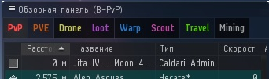
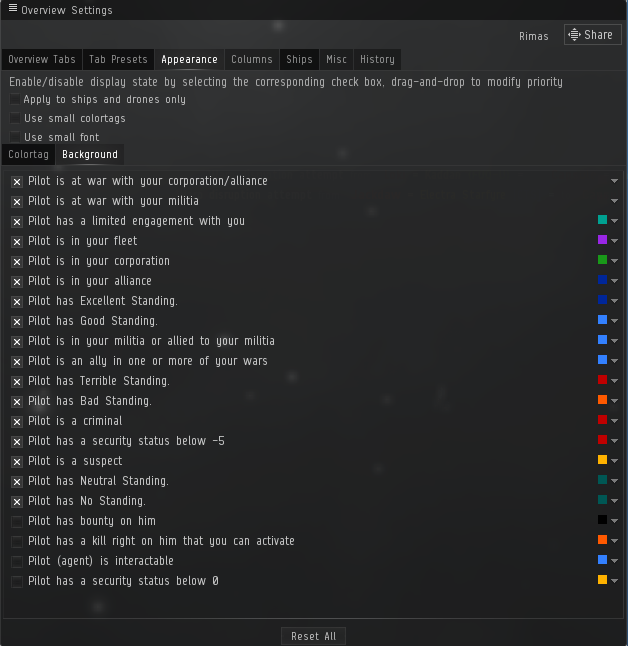

# Overview for EVE Online
##  It is mod Barkkor overview
Mod based on the version **4.65**
**[Bakkor website](http://barkkor.blogspot.nl/p/overview.html)**

## Reminder of changes:

#### Global settings:

	1. Tabs are sorted
	2. Changed order of columns Velocity and Alliance
	3. background indication of the ships is recoloured
	4. del = in name tab
	5. neutral yellow icon

#### PvP:
	1. del Citadel
	2. del Engineering Complex
	3. del Scanner Probe - 479 
	4. add Interdiction Probe - 548
	5. add Scatter Container - 1207

#### PvE:
	1. del 479 Scanner Probe

#### Loot:
	1. add Scatter Container - 1207
	2. del Sun - 6
	3. del Biomass - 14
	4. add Spawn Container - 306
	5. add Mission Container - 952

#### WarpOut:
	1. add Warp Gate - 366
	2. add Wormhole - 988
	3. add Sun - 6

#### Mining:
	1. add Asteroid Belt - 6
	2. del Scanner Probe - 479 
	3. del Interdiction Probe - 548

#### B-DScan-ShipsProbes:
	1. add Mobile Warp Disruptor - 361
	2. add Interdiction Probe - 548

##  
### Background indication
 

